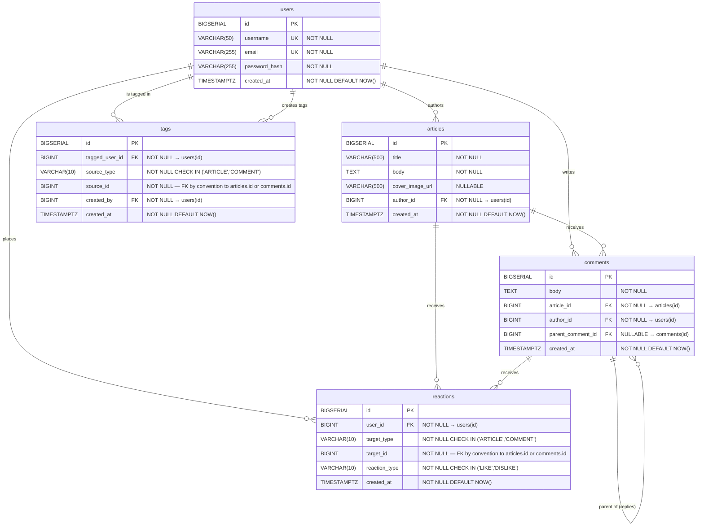

# Entity Relationship Diagram

## Mermaid ERD

## Relationship Notes

| Relationship | Cardinality | Cascade |
|---|---|---|
| users → articles | one-to-many | DELETE CASCADE |
| users → comments | one-to-many | DELETE CASCADE |
| users → reactions | one-to-many | DELETE CASCADE |
| articles → comments | one-to-many | DELETE CASCADE |
| articles → reactions | one-to-many (via target_type='ARTICLE') | DELETE CASCADE |
| comments → reactions | one-to-many (via target_type='COMMENT') | DELETE CASCADE |
| comments → comments | self-referential (replies) | DELETE CASCADE |
| tags.tagged_user_id → users | many-to-one | DELETE CASCADE |
| tags.created_by → users | many-to-one | DELETE CASCADE |

## Unique Constraints

- `users.username` — one account per username
- `users.email` — one account per email address
- `reactions(user_id, target_type, target_id)` — one reaction per user per target, prevents duplicate likes/dislikes at the database level

## Polymorphic Pattern (reactions table)

The `reactions` table uses a discriminator column pattern:
- `target_type IN ('ARTICLE', 'COMMENT')` identifies which entity the reaction belongs to
- `target_id` is the primary key of that entity
- `reaction_type IN ('LIKE', 'DISLIKE')` captures the reaction kind
- This single table handles reactions on both articles and comments, avoiding table proliferation
- The unique constraint on `(user_id, target_type, target_id)` ensures each user has at most one reaction per target

## Polymorphic Pattern (tags table)

The `tags` table uses the same discriminator column pattern:
- `source_type IN ('ARTICLE', 'COMMENT')` identifies which entity the tag belongs to
- `source_id` is the primary key of that entity
- This avoids two separate tag tables while keeping the schema flexible
- The check constraint ensures only valid source types are stored
