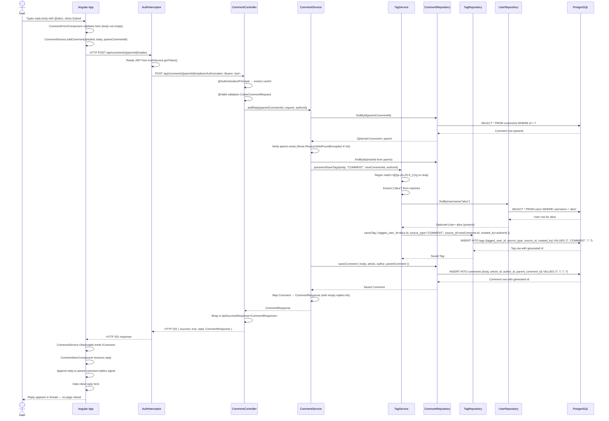

# Sequence Diagram: Authenticated User Posts a Reply with @mention

This diagram shows the complete flow when an authenticated user submits a reply to a comment that includes an @mention of another user.

## Mermaid Sequence Diagram

## Flow Summary

1. User types reply body containing `@alice` and clicks Submit
2. Angular validates the form and calls `CommentService.addComment()`
3. `AuthInterceptor` attaches the JWT `Bearer` token to the request
4. `CommentController` validates the request body and extracts the authenticated user ID
5. `CommentService.addReply()` loads the parent comment and delegates to `TagService`
6. `TagService` parses `@mentions` with a regex, resolves each username via `UserRepository`, and persists a `Tag` row for each valid match — silently skipping unknown usernames
7. `CommentRepository` persists the new `Comment` with `parent_comment_id` set
8. The `CommentResponse` travels back up through the layers
9. Angular appends the new reply to the parent comment's `replies` array in the Signals-based state — no page reload required
